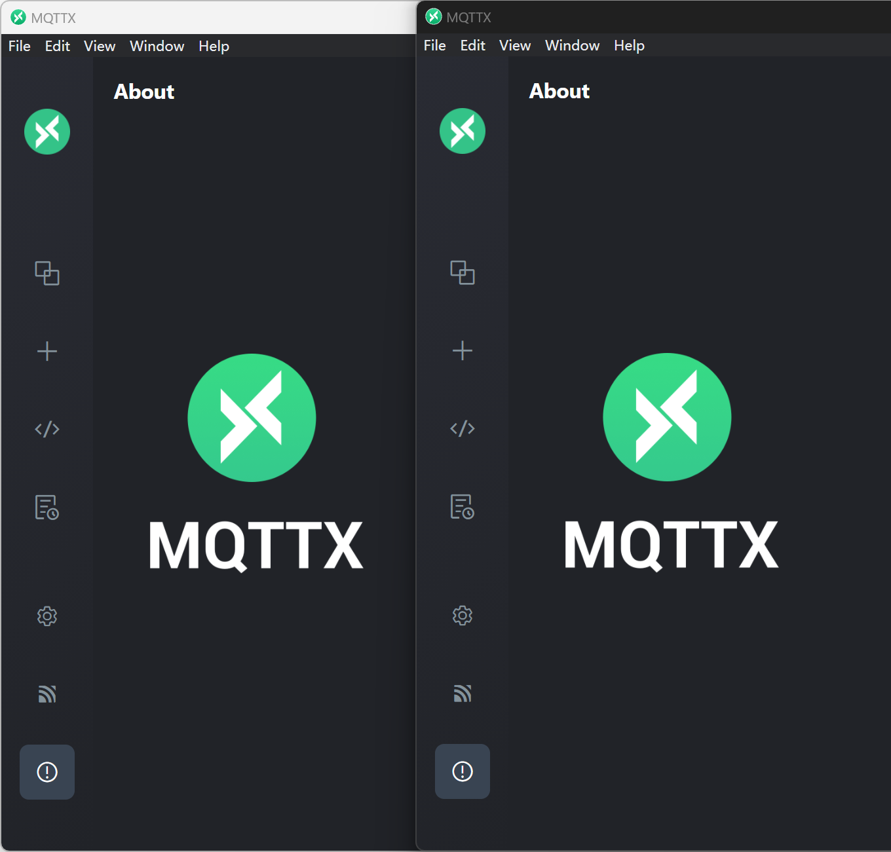

 

# MakeDark

Make your windows application launch as dark mode.

## Usage

Drag&drop the `*.lnk` or `*.exe` file to `makedark.exe`.

And then the `*.lnk` file will be edited to launch using MakeDark.

## Effect

Example for MQTTX:

